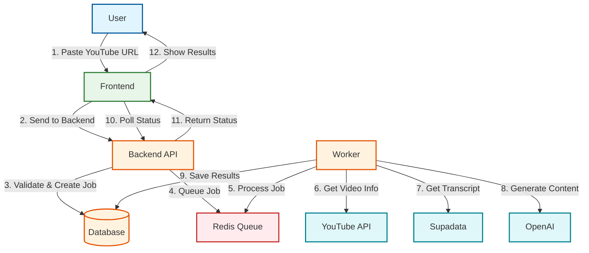

# NoteTube AI - System Flow Diagram

## Flow Explanation

### 1. User Submission
- User pastes a YouTube URL into the web interface
- Frontend sends the URL to the backend API

### 2. Job Creation
- Backend validates the URL
- Creates a job record in the database
- Adds the job to the processing queue

### 3. Background Processing
- Worker picks up the job from the queue
- Fetches video metadata from YouTube
- Gets transcript using Supadata
- Generates notes, chapters, and flashcards using OpenAI
- Saves all results to the database

### 4. Status Updates
- Frontend periodically checks job status
- Backend returns current processing state
- Progress is shown to the user

### 5. Completion
- When processing finishes, results are displayed
- User can interact with the generated content

## Components

- **Frontend**: Next.js web interface
- **Backend API**: FastAPI server
- **Database**: PostgreSQL for storage
- **Queue**: Redis for job management
- **Worker**: Background job processor
- **External Services**: YouTube, Supadata, OpenAI APIs

## Error Handling
- Failed jobs are logged and can be retried
- Users see clear error messages
- System handles rate limits and API failures gracefully
